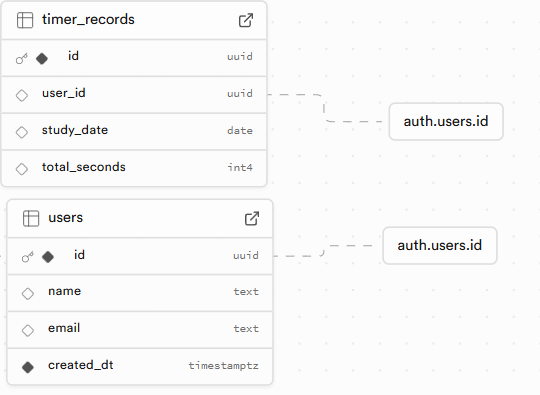

## 1. 프로젝트 개요

### 1.1 목적
- Next.js 타이머 개발 (60분)
- Supabase를 활용한 누적 타이머 통계

### 1.2 주요 기능
- 기본 타이머 기능 
    - 5분 ~ 60분, 5분간격으로 설정
    - 일시정지/재시작
    - 타이머 완료 시 알림
- 사용자 관리
    - 로그인/회원가입
    - 개인별 학습 통계
    - 회원 탈퇴
- 통계 기능
    - 로그인 한 사용자의 누적된 타이머를 주,월,연간 별로 통계

## 2. 기술 스택

### 2.1 Frontend
- Next.js 15
- TailwindCSS
- Heroicons
- Recharts

### 2.2 Backend/Database
- Supabase
    - Authentication
    - Database

### 2.3 Database Schema 
- users
- timer_records

#### Table Structure
